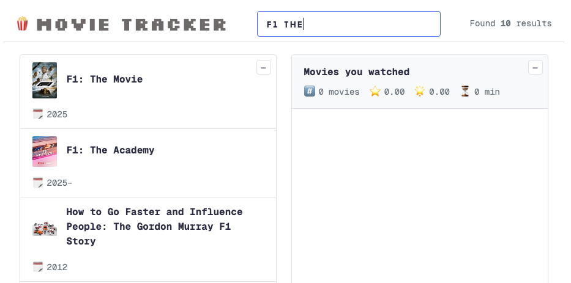

### Welcome to Movie Tracker



- A simple React-based movie tracking app.  
  Deployed on **Vercel**: [Movie Tracker](https://movie-tracker-mauve.vercel.app/)

- Inspired by the React tutorial by [Jonas Schmedtmann](https://www.udemy.com/course/the-ultimate-react-course/).

---

_Features_

- Search for movies
- Add/remove movies from your watchlist
- Mark movies as watched
- See details and ratings

---

_Tech Stack_

- React
- JavaScript
- CSS
- Vercel for development

---

_Run locally_

1. Clone the project and install dependencies:

```bash
git clone <https://github.com/jianyang18/movie-tracker>
cd movie-tracker
npm install
```

2. Start the development server:

```
npm start

Open http://localhost:3000 in your browser.
The page will reload automatically when you make changes, and lint errors will appear in the console.
```
